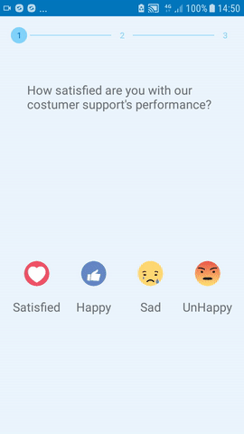

# Android Survey

Survey is a Android application for surveys, with main goals:

  - Make the user willing to take the survey.
  - Design the survey for user so they can fill it out with minimum effort.

# How it looks!

  

### Libraries Used
- [Glide](https://bumptech.github.io/glide/) for image loading 
- [Volley](https://developer.android.com/training/volley/index.html) for networking Android apps easier and faster
- [Material Design](https://material.io/design/) to create intuitive and beautiful products
- [StepView](https://github.com/shuhart/StepView) for animated step view

### Reference
 - UI based on this [article](https://medium.com/budi-brain/designing-in-app-survey-6163304e88dd)   

## Authors

* **Schoinochoritis Ioannis** 

## License

This project is licensed under the MIT License - see the [LICENSE.md](LICENSE.md) file for details
